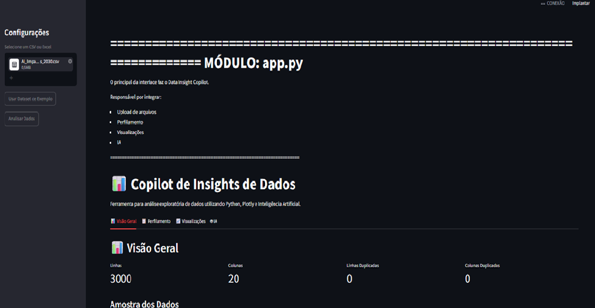
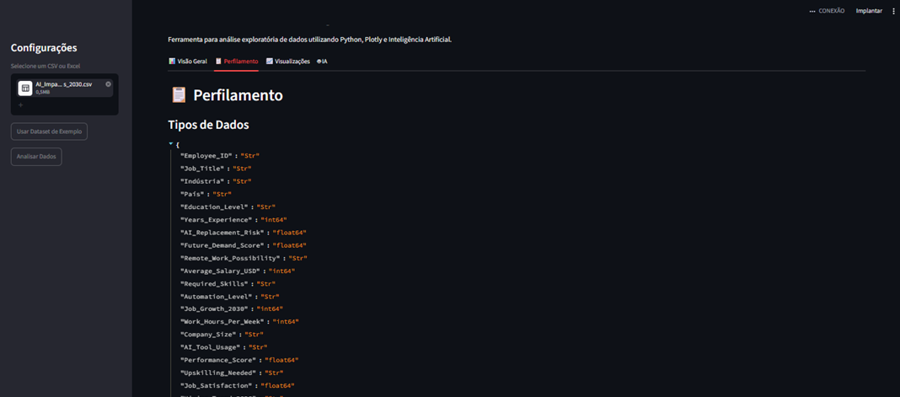
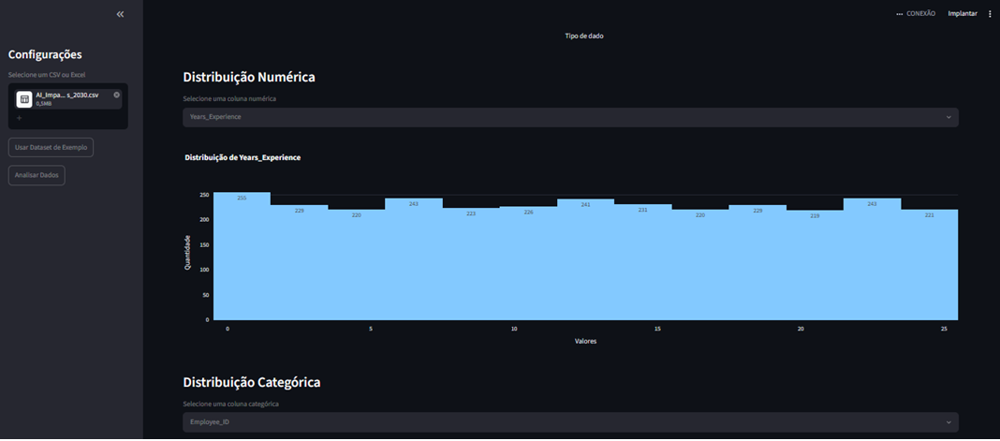
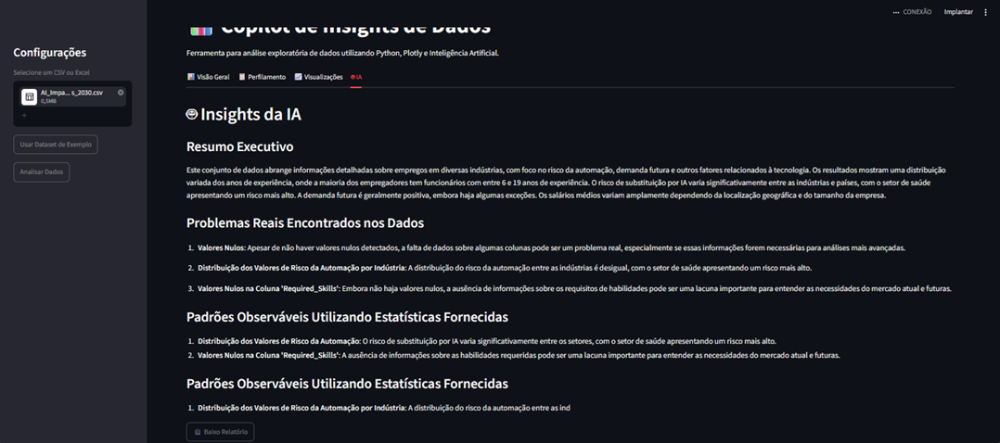

# 📊 Data Insight Copilot

> Um copiloto inteligente para Análise Exploratória de Dados (EDA) utilizando **Python**, **Streamlit**, **Plotly** e **LLMs Locais (Ollama)**.

---

## 📖 Sobre o Projeto

O **Data Insight Copilot** foi desenvolvido para automatizar as etapas iniciais da análise exploratória de dados (Exploratory Data Analysis - EDA).

A aplicação permite carregar um conjunto de dados, gerar automaticamente um diagnóstico completo da base, criar visualizações interativas e solicitar que uma Inteligência Artificial produza um relatório analítico contendo padrões, problemas encontrados e recomendações de negócio.

Todo o processamento ocorre localmente utilizando o **Ollama**, preservando a privacidade dos dados.

---

## 🚀 Funcionalidades

✔ Upload de arquivos CSV

✔ Upload de arquivos Excel (.xlsx)

✔ Dataset de demonstração

✔ Profiling automático

- Quantidade de linhas
- Quantidade de colunas
- Valores nulos
- Linhas duplicadas
- Colunas duplicadas
- Tipos de dados
- Estatísticas descritivas

✔ Visualizações automáticas

- Valores nulos
- Tipos de dados
- Distribuições numéricas
- Distribuições categóricas

✔ Geração de Insights utilizando IA Local (Ollama)

✔ Download do relatório em texto

✔ Sistema de Logs

✔ Self Test de todos os módulos

✔ Arquitetura modular

---

# 🖥 Interface

## Tela Inicial

> 

---

## Profiling

> 

---

## Visualizações

> 

---

## Insights da IA

> 

---

# 🏗 Arquitetura

```
Data Insight Copilot
│
├── app.py                 # Interface Streamlit
├── main.py                # Inicialização da aplicação
│
├── src/
│   ├── config.py
│   ├── logger.py
│   ├── data_loader.py
│   ├── profiler.py
│   ├── charts.py
│   └── ai_engine.py
│
├── tests/
│   ├── test_runner.py
│   └── relatorio_teste.txt
│
├── data/
├── logs/
├── output/
│
├── requirements.txt
└── README.md
```

---

# 🧩 Estrutura dos módulos

## app.py

Responsável pela interface do usuário utilizando Streamlit.

---

## data_loader.py

Responsável por:

- carregar arquivos CSV
- carregar arquivos Excel
- validar formatos
- importar dataset de demonstração

---

## profiler.py

Realiza o diagnóstico do DataFrame.

Produz informações como:

- linhas
- colunas
- valores nulos
- duplicidades
- estatísticas
- tipos de dados

---

## charts.py

Gera automaticamente gráficos utilizando Plotly.

---

## ai_engine.py

Responsável por:

- construção do prompt
- comunicação com o Ollama
- geração de insights

---

## logger.py

Gerenciamento de logs da aplicação.

---

## config.py

Centraliza todas as configurações do projeto.

---

# ⚙ Tecnologias Utilizadas

- Python
- Pandas
- Streamlit
- Plotly
- Ollama
- OpenPyXL
- KaggleHub

---

# 📦 Instalação

Clone o projeto

```bash
git clone https://github.com/SEU-USUARIO/data-insight-copilot.git
```

Entre na pasta

```bash
cd data-insight-copilot
```

Crie o ambiente virtual

```bash
python -m venv venv
```

Ative

### Windows

```bash
venv\Scripts\activate
```

### Linux / Mac

```bash
source venv/bin/activate
```

Instale as dependências

```bash
pip install -r requirements.txt
```

---

# 🤖 Configurando o Ollama

Instale o Ollama:

https://ollama.com/

Baixe o modelo utilizado:

```bash
ollama pull qwen2.5:3b
```

Inicie o serviço:

```bash
ollama serve
```

---

# ▶ Executando

Via Streamlit

```bash
streamlit run app.py
```

ou

```bash
python main.py
```

---

# 🧪 Testes

O projeto possui um sistema interno de validação dos módulos.

Executar:

```bash
python tests/test_runner.py
```

Será gerado automaticamente:

```
tests/
└── relatorio_teste.txt
```

com o resultado dos testes.

---

# 🔄 Fluxo da Aplicação

```
Dataset

      ↓

Data Loader

      ↓

Profiler

      ↓

Charts

      ↓

IA (Ollama)

      ↓

Insights
```

---

# 🎯 Objetivos do Projeto

- Automatizar a etapa inicial da EDA.
- Integrar IA Local em projetos de Data Science.
- Demonstrar boas práticas de Engenharia de Software.
- Servir como projeto de portfólio.

---

# 🚀 Roadmap

### Versão 1.0 ✅

- Interface Streamlit
- Profiling
- Visualizações
- IA Local
- Sistema de Logs
- Self Test

### Próximas versões

- Exportação para PDF
- Exportação para PowerPoint
- Dashboard executivo
- Chat com o dataset
- Geração automática de insights por gráfico
- Integração com bancos de dados
- Upload múltiplo de arquivos

---

# 👨‍💻 Autor

**Rafael**

Projeto desenvolvido para estudos de:

- Python
- Data Science
- Engenharia de Software
- Inteligência Artificial
- Análise Exploratória de Dados (EDA)

---

# 📄 Licença

Este projeto foi desenvolvido para fins educacionais e de demonstração de portfólio.
